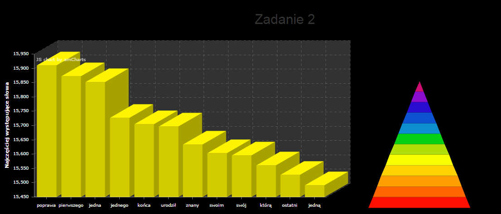
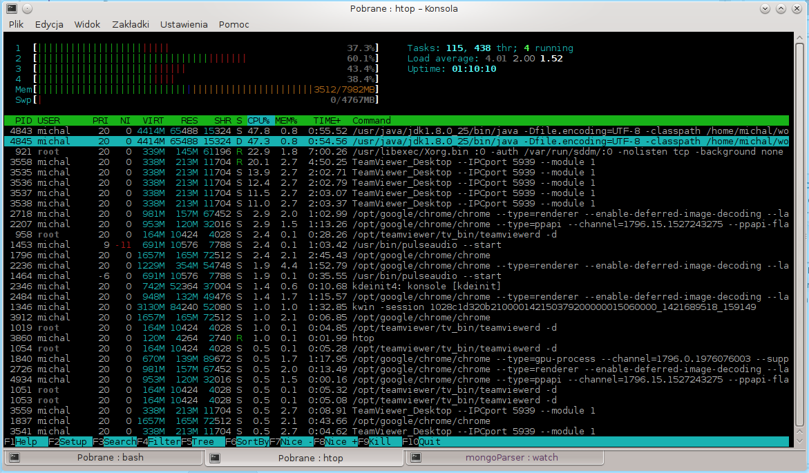
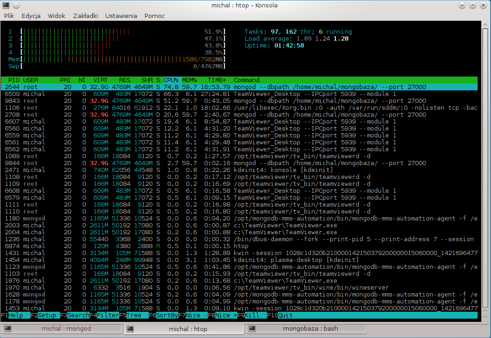
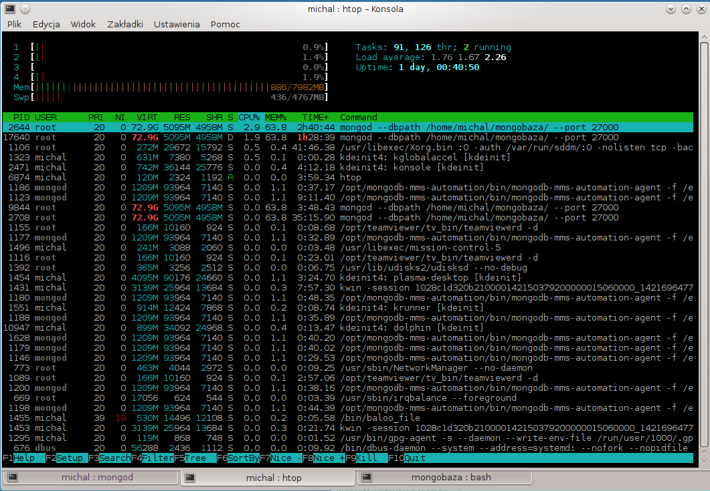

# Michał Skałkowski MongoDB

Zadania pierwsze wykonane na laptopie:

~~~~
HP ProBook 4520s
Pamięć: 4GB RAM
Procesor: intel i3-350M
Dysk: Hitachi HTS725050A9A364 7200RPM 
System: Mint 17
Mongo: MongoDB 2.6.7

~~~~

Zadanie drugie wykonane na stacjonarce: 

~~~~
Pamięć: 8GB RAM
Procesor: amd Phenom II X4 965 @4GHz
Dysk: WDC 1TB 7200RPM 
System: Fedora 21 Kde
Mongo: MongoDB 2.6.7
~~~~

Zadania zostały wykonane na innych komputerach, ponieważ robiłem je jeszcze raz, a zadanie drugie niestety bardzo długo się wykonywało, to postanowiłem na innym komputerze w trakcie robić pierwsze zadanie.
## Zad 1
Podlaczylem do zadania mongo mms

Dodałem do pliku na początek linijkę egzamin, aby byl to plik csv i nie tracic pierwszego slowa. Nastepnie dokonalem importu pliku

Import
~~~
time mongoimport --type csv -c egzamin1 --file word_list.txt --headerline --port 27000

czas:
real	0m0.713s
user	0m0.043s
sys	0m0.033s

~~~

A nestepnie wykonalem Map i Reduce za pomoca [pliku](egzaminMapReduce.js).
~~~
time mongo egzaminMapReduce.js 

czas: 
real	0m2.070s
user	0m0.048s
sys	0m0.016s

~~~

Wyeksportowałem posortowane dane za pomocą [skryptu](toJson.js) do [pliku](wyniki.json).
~~~

time mongo toJson.js > wyniki.json

real	0m2.070s
user	0m0.048s
sys	0m0.016s
~~~

Żeby zobaczyć wyniki w ladnym wykresie, zapraszam na [strone](http://egzamin.project-midas.com), która specjalnie stworzylem na potrzeby ladnej prezentacji danych do egzaminu.

## Zad2
Do tego ściągnąłem najnowszą wersję wikipedii plwiki-20150116-pages-articles-multistream.xml.bz2. Wszystkie słowa, które parsuję, zapisuję w małych literach. Są to dwa powody, przez które mogę mieć inne wyniki niż koledzy.

Parsowanie pliku za pomoca [Parser.java](Parser.java)
~~~
czas: 22m10s
~~~

i usuwanie pustych linii za pomocą [Cleaner.java](Cleaner.java)

~~~
czas: 19m56s
~~~

Import
~~~
time mongoimport --type csv -c egzamin --file wikipoParsowaniu.txt --headerline

czas: 
real	22m56.580s
user	0m18.398s
sys	0m31.687s
~~~

Po imporcie wykonuję Map i Reduce dzięki [skryptowi](egzamin2MapReduce).

~~~
mongo egzamin2MapReduce.js

czas: 16:20:03
~~~

Tutaj również wykonałem export do pliku za pomocą [skryptu](toJson2.js):

~~~~
mongo --port 27000 toJson2.js > odp2.json 
~~~~

####Najczęstrze słowa
~~~
{
"value" : "poprawa",
"count" : 15911
},
{
"value" : "pierwszego",
"count" : 15873
},
{
"value" : "jedna",
"count" : 15852
},
{
"value" : "jednego",
"count" : 15727
},
{
"value" : "końca",
"count" : 15705
},
{
"value" : "urodził",
"count" : 15697
},
{
"value" : "znany",
"count" : 15633
},
{
"value" : "swoim",
"count" : 15604
},
~~~

Zapraszam do spojrzenia na [stronę](http://egzamin.project-midas.com) na wykres.
