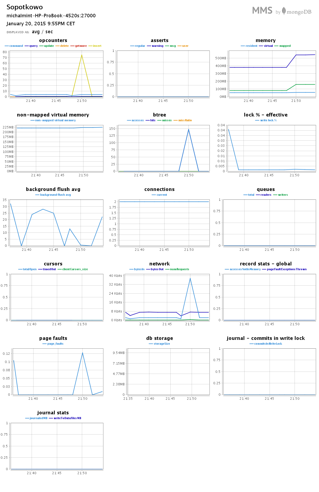
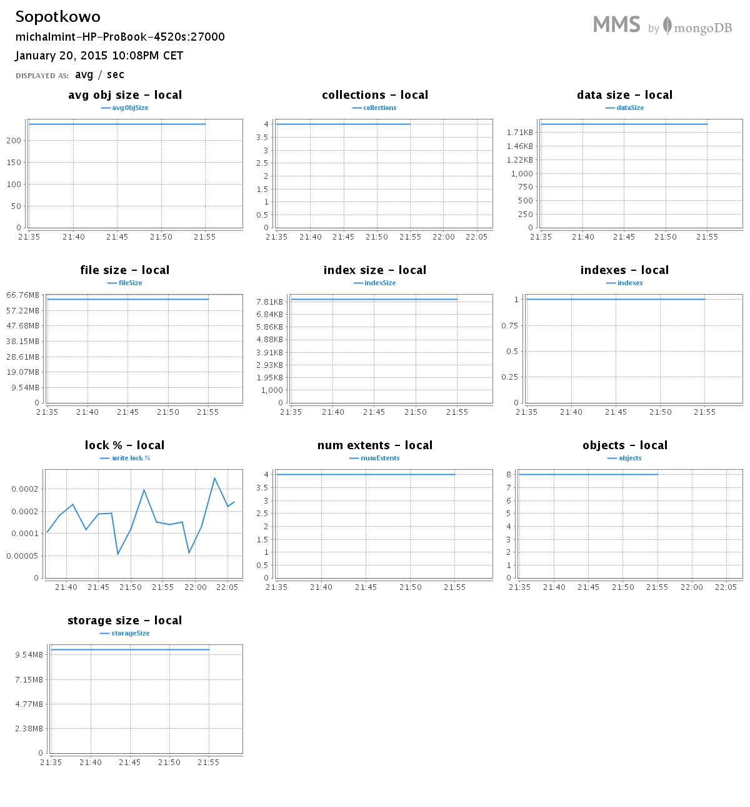
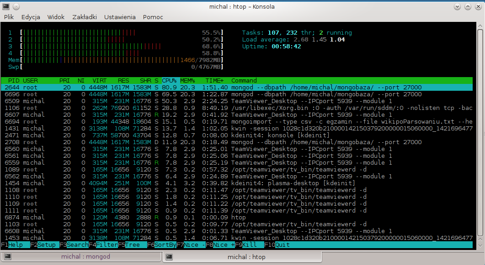
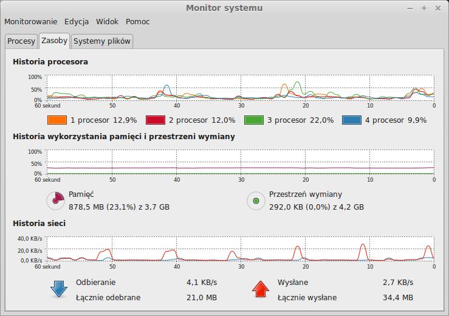

# Michał Skałkowski MongoDB

Zadania pierwsze wykonane na laptopie:

~~~~
HP ProBook 4520s
Pamięć: 4GB RAM
Procesor: intel i3-350M
Dysk: Hitachi HTS725050A9A364 7200RPM 
System: Mint 17
Mongo: MongoDB 2.6.7

~~~~

Zadanie drugie wykonane na stacjonarce: 

~~~~
HP ProBook 4520s
Pamięć: 4GB RAM
Procesor: intel i3-350M
Dysk: Hitachi HTS725050A9A364 7200RPM 
System: Mint 17
Mongo: MongoDB 2.6.7
~~~~

Zadania zostały wykonane na innych komputerach, ponieważ robiłem je jeszcze raz, a zadanie drugie niestety bardzo długo się wykonywało, to postanowiłem na innym komputerze w trakcie robić pierwsze zadanie.
## Zad 1
Podlaczylem do zadania mongo mms

Dodałem do pliku na początek linijkę egzamin, aby byl to plik csv i nie tracic pierwszego slowa. Nastepnie dokonalem importu pliku

Import
~~~
time mongoimport --type csv -c egzamin1 --file word_list.txt --headerline --port 27000

czas:
real	0m0.713s
user	0m0.043s
sys	0m0.033s

~~~

A nestepnie wykonalem Map i Reduce za pomoca [pliku](egzaminMapReduce.js).
~~~
time mongo egzaminMapReduce.js 

czas: 
real	0m2.070s
user	0m0.048s
sys	0m0.016s

~~~

Wyeksportowałem posortowane dane za pomocą [skryptu](toJson.js) do [pliku](wyniki.json).
~~~

time mongo toJson.js > wyniki.json

real	0m2.070s
user	0m0.048s
sys	0m0.016s
~~~

Żeby zobaczyć wyniki w ladnym wykresie, zapraszam na [strone](egzamin.project-midas.com), która specjalnie stworzylem na potrzeby ladnej prezentacji danych do egzaminu.

## Zad2
Parsowanie pliku za pomoca Parser.java i usuwanie pustych linii za pomocą Cleaner.java
~~~
czas: 52:30
~~~

Import
~~~
time mongoimport --type csv -c egzamin --file wikipoParsowaniu.txt --headerline

czas: 
real	22m56.580s
user	0m18.398s
sys	0m31.687s
~~~

Map Reduce
~~~
mongo egzamin2MapReduce.js

czas: 12:20:03
~~~

####Najczęstrze słowa
~~~
> db.wynikowaBaza.find().sort({value:-1}).limit(3)
{ "_id" : "w", "value" : 20292468 }
{ "_id" : "i", "value" : 5780516 }
{ "_id" : "a", "value" : 5407771 }
~~~

Tutaj również wykonałem export do pliku za pomocą [skryptu](toJson2.js):

~~~~
mongo --port 27000 toJson2.js > odp2.json 
~~~~